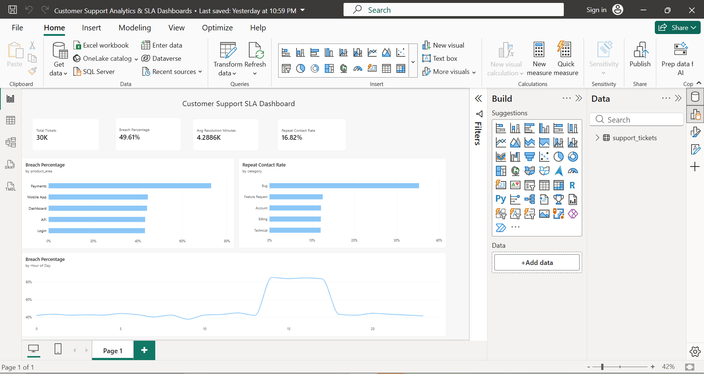
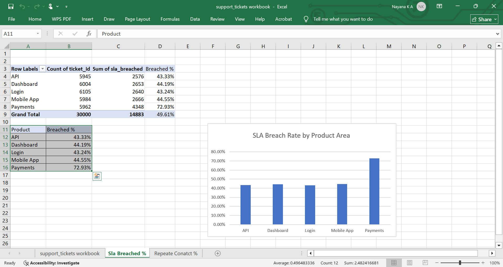
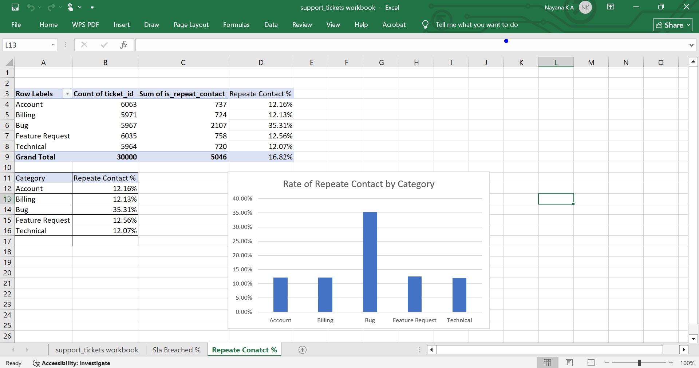
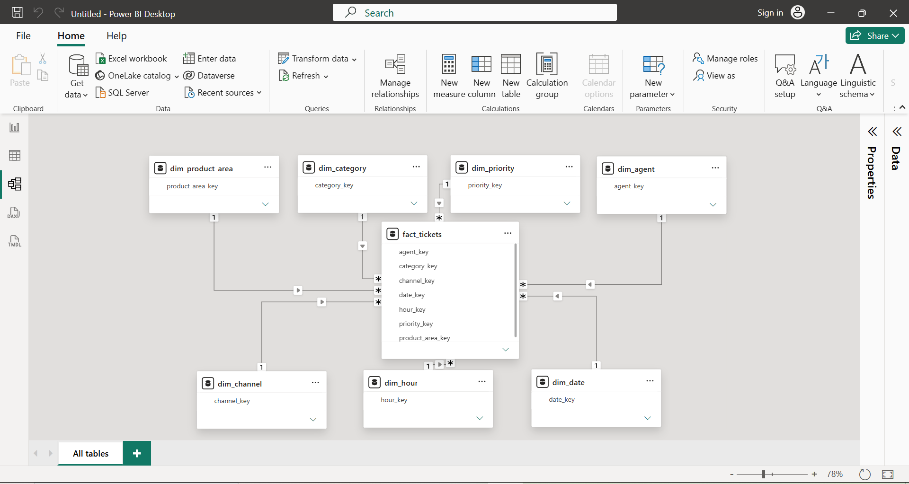
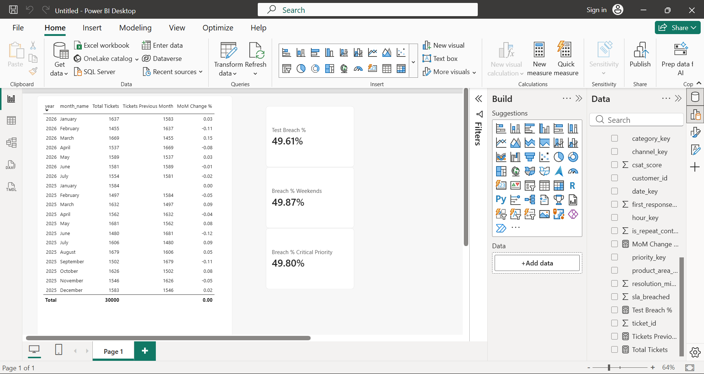

# Customer Support SLA Analytics

## Problem Statement

Customer support teams operate against Service Level Agreements (SLAs) — promised response and resolution times for customer tickets. Missing these targets damages customer trust and satisfaction. This project analyzes 30,000 simulated support tickets to answer: **where and when is the support team missing its SLA targets, and why?**

## Approach

1. Generated a realistic 30,000-row support ticket dataset (SQLite + CSV) covering category, priority, channel, product area, agent, response/resolution times, CSAT, and repeat contacts
2. Wrote SQL queries to quantify SLA compliance across multiple dimensions (category, product area, time of day, agent)
3. Built an interactive Power BI dashboard to visualize findings for stakeholders
4. Cross-validated findings using Excel pivot tables and formulas

## Key Findings

**1. Overall SLA compliance is critically low**
Approximately 50% of all support tickets (14,883 of 30,000) breach their SLA target — essentially a coin flip on whether a customer's issue is handled on time.

**2. Payments is the primary bottleneck**
Tickets related to the Payments product area breach SLA at a **72.9% rate** — nearly double every other product area (which range 43-45%). Payments tickets also take almost **2x longer to resolve on average** (6,021 minutes vs. ~3,850 minutes elsewhere).

**3. A sharp capacity gap exists between 2 PM and 5 PM**
Breach rates spike to **~84%** during this four-hour window, compared to a ~42% baseline for the rest of the day — consistent with a staffing or shift-coverage gap during peak afternoon hours.

**4. Bug tickets drive disproportionate repeat contacts**
35.3% of Bug-category tickets result in a repeat customer contact within 7 days — roughly 3x the rate of any other category (~12%).

**5. The issue is systemic, not individual**
Agent-level analysis showed consistent performance across the team (47-50% breach rate range), ruling out individual agent performance as the root cause.

## Recommendations

- Prioritize a root-cause review of the Payments support workflow
- Add staffing coverage during the 2-5 PM window
- Introduce a QA/verification step for Bug ticket closures to reduce repeat contacts
- Document and share best practices from consistently top-performing agents

## Tools Used
- **SQL** (SQLite) — data querying and aggregation
- **Power BI** — interactive dashboard, DAX measures
- **Excel** — pivot tables, cross-validation, charting
- **Python** — synthetic data generation (Faker library)

## Files in this repository
- `/sql` — analysis queries with comments
- `/powerbi` — Power BI dashboard file (.pbix)
- `/excel` — Excel workbook with pivot tables and charts
- `/data` — dataset (CSV)
- `/screenshots` — dashboard and chart images

## Dashboard Screenshots

## Data Modeling — Star Schema

Extended the analysis with a proper star schema (1 fact table + 7 dimension tables) and time intelligence measures.

